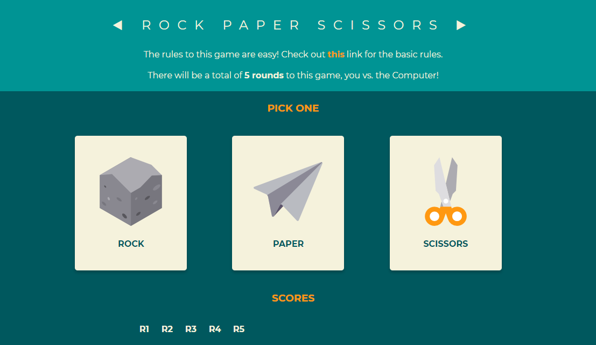
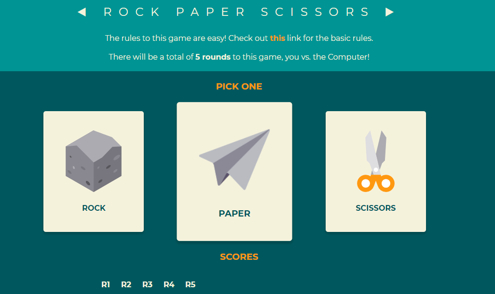
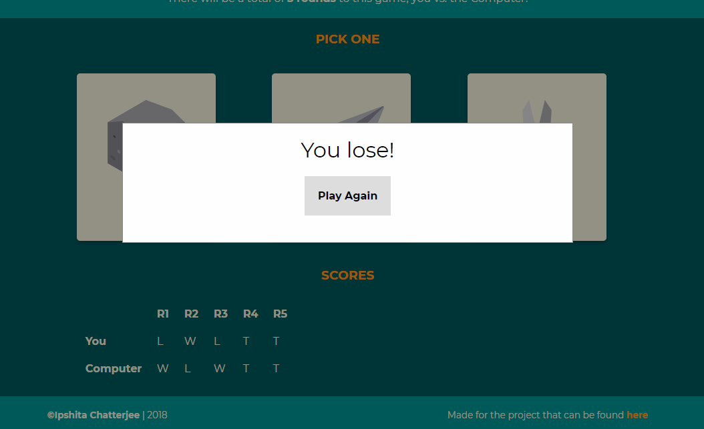

# Rock-Paper-Scissors
One of the first few JavaScript projects I will be taking on
This project is a take on the traditional rock paper scissors game, details of which can be found [here](https://en.wikipedia.org/wiki/Rock%E2%80%93paper%E2%80%93scissors).

## Motivation
I started out with the very informative courses at [The Odin Project](https://www.theodinproject.com/courses/web-development-101) and have begun with **Web Development 101**. This part was one of the many sub-projects I shall be taking on in the **Javascript Basics** porton. The entire exercise is proving to be a very good learning experience.

## Screenshots

